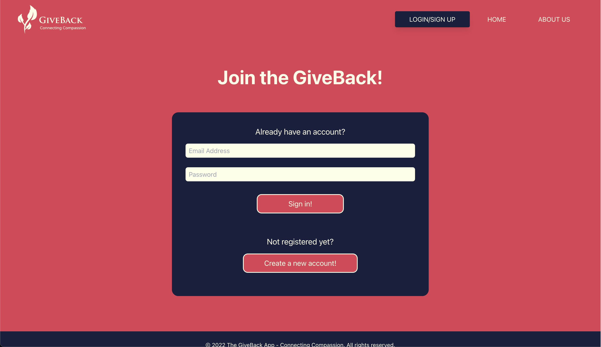

# The GiveBack App

## Expected Outcome: 
- The User will be able to sign up or login to app
- The User will be able to search for non-profit organizations
- The User will be able to make a payment to the selected non-profit organizations once clicked upon
- The User will be able to save non-profit organizations to their profile
- The User will be able to contact GiveBack with new non-profti organizations to be added to the GiveBack database

## Technology used:
- Graphql and the Apollo Server
- MongoDb 
- React.js
- FontAwsome
- Express.js
- Tailwind for styling
- Heroku

## Contributors:
- Kianna Reid (https://github.com/Kianna41)
- Cristina Yunes (https://github.com/Yuyitax)
- Leo Thomas (https://github.com/leothoma88)
- Foster Thomas (https://github.com/pfthomas)

## Visuals:

## Launch website
** Please use the following link to launch: [The GiveBack App](https://)

- - -
© 2022 The GiveBack App Contributors. All Rights Reserved.
